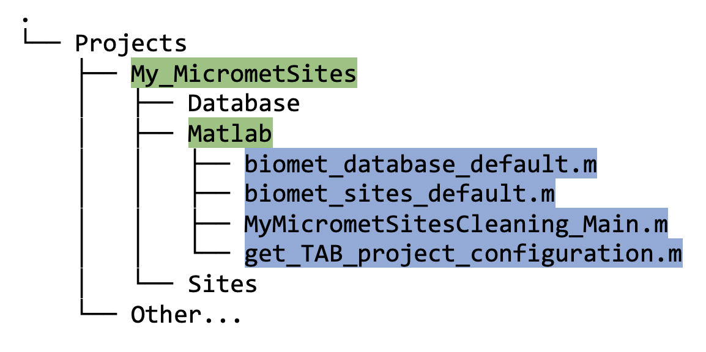

## Configure Matlab to work with the Data Structure

* Once your directory structure looks good (see [link] Setup_Project_Directory_Structure), obtain the function `get_TAB_project_configuration.m` [XXX how?], and put it in the `<projectPath>/Matlab` directory. 

* *Edit* (but do not run) `get_TAB_project_configuration.m`, by entering your projectName (user-preferred name, this is not used for processing). The file should look something like this:

    ```
    function structProject = get_TAB_project_configuration  (projectPath)
    projectName = 'My_MicrometSites are the best';
    structProject.projectName   = projectName;
    structProject.path      	= fullfile(projectPath);
    structProject.databasePath  = fullfile(structProject.path,'Database');
    structProject.sitesPath 	= fullfile(structProject.path,'Sites');
    structProject.matlabPath	= fullfile(structProject.path,'Matlab');
    ```

* Next, run `set_TAB_project(<projectPath>)` where `<projectPath>` is the **full** filepath to your project directory (as described in 9_Setup_Project_Directory_Structure.md [XXX link]). E.g., if your project name is `My_MicrometSites`, provide the full filepath to that directory [XXX figure below DirectoryTree4.jpg...] This process sets up the `Biomet.net` toolbox to work with that project. 

* Matlab is now ready to run data processing and cleaning for that particular project.

* Finally, the “best-practice” approach for each project is to have one “main” script for data processing (e.g. `MyMicrometSitesCleaning_Main.m`). This script should contain all the steps that are needed to go from raw data to the final gap-filled Ameriflux “clean” data set:
    1. Obtaining/downloading the raw data; 
    2. Creating the database in the appropriate format (section [XXX link]);
    3. Applying the data-cleaning stages (section [XXX link]).

With that “main” script the entire data processing is documented and it can be easily replicated. Insert as many comments as you can - it will help if the process needs to be reviewed later on.

[XXX add example of main matlab script from TPAG? replace example later with EddyPro specific files]

At this point, your Matlab directory should contain the following files:



The two files not previously discussed, i.e., `biomet_database_default.m` and `biomet_sites_default.m` were automatically generated by `set_TAB_project.m`.

We provide a comprehensive working example for the Delta Salt Marsh (DSM) Micromet site (section [XXX link]) showing the full directory structure, as well as the process of setting up and running data cleaning for that site. [XXX move this paragraph?]
