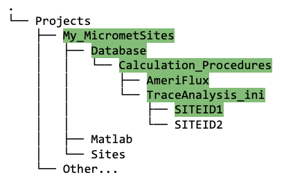
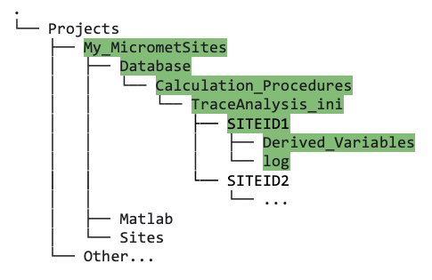

## 10a. Set Up Project Directory Structure

**If you followed the quick-start set up in section 9, you should skip this section.** 

Here is the long version of how to set up your project directory structure and configure Matlab to work with Biomet.net. For the "Quick Start" guide to both these procedures, see section [XXX link].

Each user should have at least one `Project` directory. This project folder encompasses data cleaning/analysis/research for a group of similar flux sites, e.g., FLUXNET-Canada-V2.0. This section describes what your project directory structure should look like for the existing data cleaning scripts to operate successfully. 

We provide you with a function as part of the Biomet library to help you set it up. Reminder that in the directory tree diagrams, <mark style="background-color: lightgreen">directory paths are highlighted in green</mark>, and <mark style="background-color: lightblue">files are highlighted in blue</mark>. [XXX fix to match exact colour used in images!]

**Important notes**: 
* We enforce using *uppercase* for site IDs, to avoid problems between running data cleaning on Mac vs. Windows. Examples: the Delta Salt Marsh site ID is `DSM`; the Turkey Point Agriculture site ID is `TPAG`.
* Site IDs *must* also be a valid Matlab variable name: they should start with a letter, can only be alphanumeric, and are allowed to contain underscores but nothing else (no hyphens), e.g., `PE_TNR`. 
* Your `<projectPath>`, which you will need when following the instructions, is the full filepath to your `Project` root directory. E.g., for the FLUXNET-Canada-V2.0 project, the project path would be similar to `/Users/<username>/FLUXNET-Canada-V2.0/` .

#### Instructions to create the correct directory structure:

* Pick *one* of your sites to start with, and create your site ID based on the notes outlined above. 

* In Matlab, run the `create_TAB_ProjectFolders.m` function (which is in the `Biomet.net` library that you cloned), as follows:
    ```
    create_TAB_ProjectFolders('<projectPath>', 'SITEID')    
    ```
    Note that both input arguments are of type "string". 

<br>

This function takes care of several steps for you, outlined next:

* In your `Project` root directory (`My_MicrometSites` in figure XXX), you should now see three directories with the following names: (1) Database, (2) Matlab, (3) Sites. In this directory tree example, there are three project root directories to illustrate the structure in case you have more than one project: My_MicrometSites (highlighted in green), CH4_V2.0, and FLUXNET-Canada-V2.0; although you may only have one. 

    


#### Database directory
* Within the new `Database` directory that you just made, you will find another new directory called `Calculation_Procedures`, and within `Calculation_Procedures`, there should be two subdirectories: `AmeriFlux` and `TraceAnalysis_ini`.
* In the `Ameriflux` folder, the `create_TAB_ProjectFolders.m` function has cloned a git repository containing necessary files (figure XXX, highlighted in blue) that will be needed later if you want to convert your clean data into AmeriFlux format.

    

* Within `TraceAnalysis_ini`, you will see a subdirectory named using your SITEID (`SITEID1` in this example), as follows:

    

* Now, if you navigate to that SITEID directory, you should see two more folders: `Derived_Variables` and `log` (figure XXX):

    
* The purpose of these will be explained later in section(s) XXX...

    Eventually (but not yet!), this `Database` directory will also contain the following:
    1. Initial database (created using the raw data from the `Sites` directory; see section [XXX add link] for how to do this);
    2. Your site-specific INI files that configure how the pipeline scripts will clean the data;
    3. The cleaned data once the INI files have been created and the pipeline has been run.


#### Sites directory
* Raw, *uncleaned* data from your site(s) is stored in the `<projectPath>/Sites` directory, under the appropriate SITEID. The data in this directory should remain *untouched* since we always want to preserve a copy of the raw data. 

    

#### Matlab directory
More details on the `<projectPath>/Matlab` directory are provided in the next section on configuring Matlab to work with the data structure [XXX link to Configure_Matlab_For_Data_Structure.md]. If everything appears as described above, then you can now move on to that section.