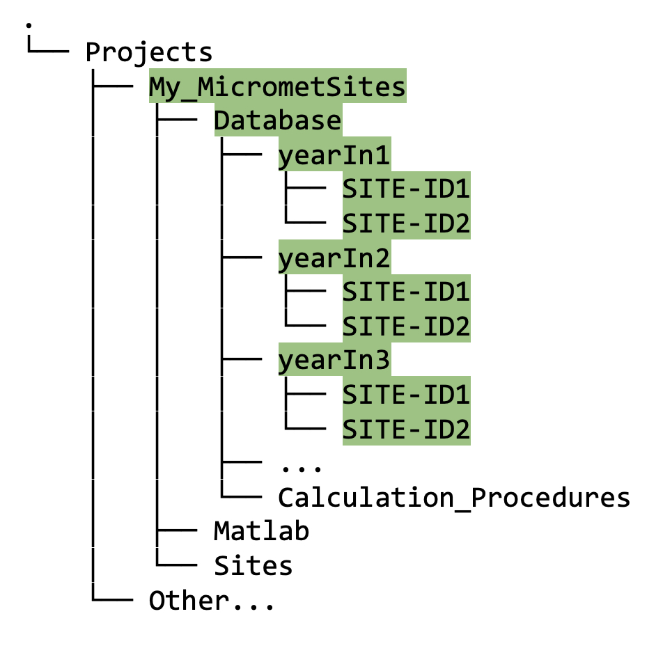

## Create Database from Raw Data and Inspect Outputs

This is the most “site-specific” part of the process, aside from the creating the first stage files (section [XXX link to create INI files]). Each flux site is unique with its own sensors, data loggers, and data archiving formats (EddyPro output files, TOA5 Campbell Sci files, Ameriflux CSV files, to name a few). The purpose of this step is to convert from such a site-specific dataset to a generic dataset ready to be processed using the standardised libraries (i.e., `Biomet.net`). As mentioned in section [XXX link to Data_Cleaning_Principles.md], these "generic" binary files can be read by most computer languages, by design, meaning they are suitable for the Biomet library which contains code written in Matlab, R, and Python. 

### Instructions for creating your own "generic" dataset:
* Determine the data format/source of raw data in your `Sites` directory. 
* Use standard existing function(s) from the Biomet.net library, which you have already cloned (section [XXX link]), to convert your raw data and create the database in `Database` directory. Examples of these functions are:
1. `db_struct2database` (create database from Matlab structure; flux or met data);
2. `fr_EddyPro_database` (create database from EddyPro output; flux data);
3. `fr_HOBO_database` (create database from HOBO met data);
4. `fr_SmartFlux_database` (create database from SmartFlux output; flux data);
5. `fr_SoilFluxPro_database` (create database from SoilFluxPro output data);
6. `fr_TOA5_database` (create database from TOA5 Campbell Scientific ASCII files).

* The relevant function, when run in matlab, will create subdirectories named by data year (`yearIn`), then by `SITEID` (i.e., SITEIDs are grouped by year), as follows:
    
    

 * The SITEID subdirectories will be populated with data (e.g., `Flux` and `Met` if these data types exist) for the appropriate year, stored as binary files ready for cleaning. The green highlighting in figure XXX shows an example with three years of data from two different sites.

* The `clean_tv` file, which will be located in each Raw/Clean folder, is a standardized time vector of 30-minute frequency. This formats the timestamp of each record in Local Standard Time (LST; as required by AmeriFlux). [XXX it is still not clear to me exactly how this file is created...]

* Depending on the sites and data, ideally you will add this code snippet that creates your database to your "one Matlab script does it all" program, discussed in section [i.e. XXX link to Configure_Matlab_For_Data_Structure.md]. Generalize your scripts as far as possible, based on the sites and data that you have, and remember to document your code thoroughly. 

### Inspect your database 
Once your database is created, we strongly advise you to review its contents contents using `Biomet.net` functions, in particular:

#### *read_bor_notes_micromet.m* function

[XXX I'm thinking this should be broken up and/or moved to the Data Visualization section because the examples in this function include cleaned data, which we haven't covered yet. Seems like the most important parts at this point, to inspect the database the user just created, are example 1 from `read_bor_notes_micromet.m` (load one trace and plot it), and the `gui_Browse_Folder` function...]

This function is intended as a manual on how to tell Matlab to read data from your newly created database, learning by example (one code section at a time, sequentially). The following notes help to describe and explain each example:

1. *Load one trace and plot it*: 
* Use the `biomet_path` function, e.g., `pth = biomet_path(2022, 'DSM', 'MET')` to give you the filepath to your data, in this case the Met data for the DSM site for all of 2022; you should not define the filepath yourself, but always use this function. 
* Use the `read_bor` function to load the time vector from the `clean_tv` file, then convert it to a datetime object using the `datetime` function.
* Use the `read_bor` function again to load the trace of your choice from the filepath you defined using `biomet_path`, e.g., `x = read_bor(fullfile(pth,'MET_CNR4_Net_Avg'))` will load the *MET_CNR4_Net_Avg* trace from the DSM Met folder for 2022, using the previously defined path.
* You can now plot your variable *x* with a nicely formatted time vector. 

2. *Compare two traces*:
* This is most useful for comparing traces from different cleaning stages, once you have cleaned your data - which we have not yet addressed. We will cover this again later in section 
* Use `biomet_path` again to define the filepath to the Second Stage clean data, e.g., `pth = biomet_path(2022,'DSM','Clean/SecondStage')` 

3. *Multiple years*: [XXX not yet complete, may need to move]

4. *Other functions for visualizing data*:
* `gui_Browse_Folder`: given a filepath, this function will open a new figure window and provide a dropdown containing all traces located at that filepath location. You can pick one or scroll through using the arrow buttons.
* `guiPlotTraces`
* `plotApp`

[XXX Move to INI description?]
When you have confirmed that all the traces you expect to see are present in your newly created Database, you are ready to start cleaning the data. First, you need to obtain the set of sample, configuration, and standardization files, describe in section [XXX link].
