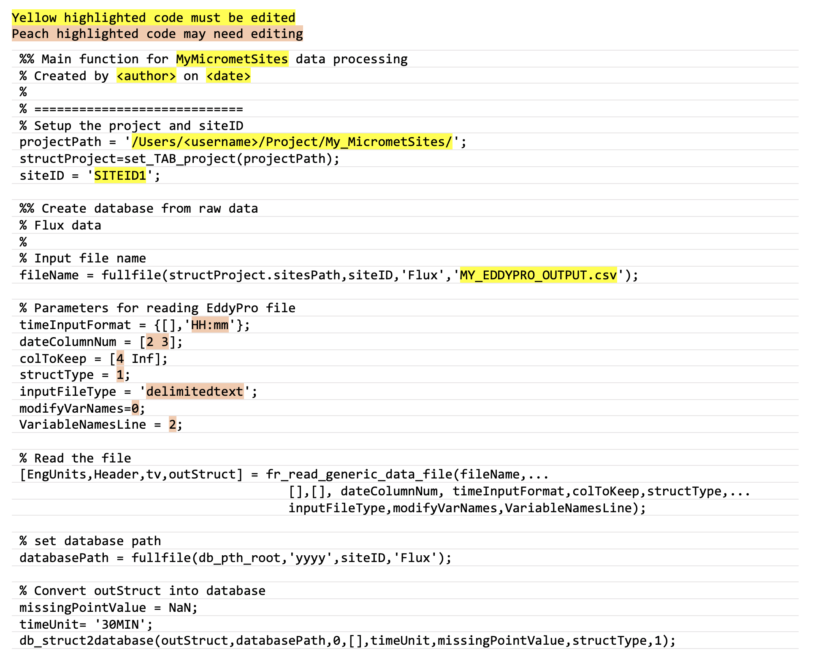

## 11. &nbsp; Quick Start Set Up: Create Database from Raw Data

This section will teach you how to convert from your own site-specific dataset to a generic dataset ready to be processed using the standardised libraries (i.e., `Biomet.net`). We will follow an example that focuses on flux-related EddyPro output data:

1. First, in your newly created `Sites` directory, within the relevant `SITEID`, create a new `Flux` folder (figure 11.1). 

    

    *Figure 11.1. Directory tree showing file path to the location where raw flux data for site with SITEID1 should be stored.*

2. Copy your EddyPro raw output data to this `Flux` folder. This data will remain untouched so that you always have a local copy of the original data.

3. In your `Matlab` folder, create one new "main" Matlab file that will act as a "do-it-all" script. The example given here (figure 11.2) &mdash; named `MyMicrometSitesCleaning_Main.m` (you can make your filename less generic but we advise including "Main") &mdash; will create the database, and later we will add the code for data cleaning: 

    
    
    *Figure 11.2. Matlab code to create database from raw EddyPro output.*

    This code can be copied at the bottom of the page. For instructions on how to convert other flux- and met-data formats, see section 12 [XXX link].

4. Next, run your "Main" Matlab program. Change any necessary input parameters (highlighted in peach), and you should see some data output in your `Database` directory. Data is grouped by year, then by site, then by data type, e.g., Flux (figure 11.3).

    

    *Figure 11.3. Directory tree showing file path to output in Database directory following database conversion.*

Your data is now in a format ready for cleaning using the pipeline.

<br>

"MyMicrometSites_Main.m" template script for copying:
```
%% Main function for MyMicrometSites data processing
% Created by <author> on <date>
% 
% ============================
% Setup the project and siteID
projectPath = '/Users/<username>/Project/My_MicrometSites/';
structProject=set_TAB_project(projectPath);
siteID = 'SITEID1';

%% Flux data
%
% Input file name
fileName = fullfile(structProject.sitesPath,siteID,'Flux','SMC_EDDYPRO_OUTPUT.csv');

% Parameters for reading EddyPro file 
timeInputFormat = {[],'HH:mm'}; 
dateColumnNum = [2 3];
colToKeep = [4 Inf];
structType = 1;
inputFileType = 'delimitedtext';
modifyVarNames=0;
VariableNamesLine = 2;       

% Read the file
[EngUnits,Header,tv,outStruct] = fr_read_generic_data_file(fileName,...
                                    [],[], dateColumnNum, timeInputFormat,colToKeep,structType,...
                                    inputFileType,modifyVarNames,VariableNamesLine);     

% set database path
databasePath = fullfile(db_pth_root,'yyyy',siteID,'Flux');

% Convert outStruct into database
missingPointValue = NaN;
timeUnit= '30MIN';
db_struct2database(outStruct,databasePath,0,[],timeUnit,missingPointValue,structType,1);
```

