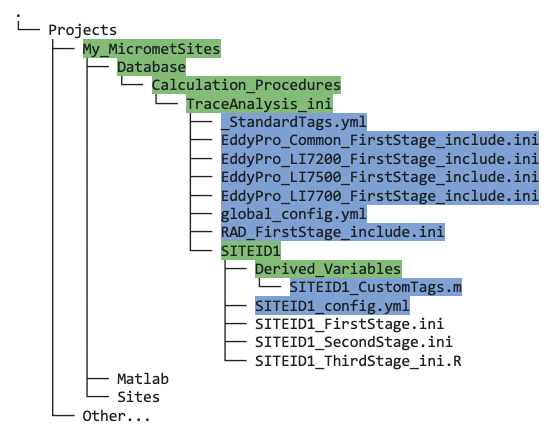

## Obtain the Necessary Sample, Configuration and Standardization Files

#### Sample INI files

As mentioned previously (but it bears repeating!), INI files are site-specific. Even if you have measurement sites that are similar in terms of sensors and how they are set up, you should still focus on one site to begin with. Once you have INI files created for your first site, you can duplicate the files and edit as necessary for your other sites.

Next steps:

* Obtain sample INI files for first, second, and third stage cleaning [XXX figure out how user will get these], and put them in your SITEID directory (figure XXX; at present you will only have one SITEID directory, but later you may have more, and these will also go in the `TraceAnalysis_ini` directory). You should use the "golden" examples you obtained as guidance to edit your own INI files.
 
    

* Next, duplicate the sample files (to keep the original samples untouched), and rename them according to your own site ID.

* Stage one and two INI files are essentially text files written in a specific format, whereas the stage three INI file is an R-script, hence the different suffix. 

* There are few more files you need to obtain, described next.

#### Configuration and Standardization Files

In addition to the INI files, there are numerous configuration and standardization files needed to run the data cleaning, most of which you *will not* edit. 

[XXX Not yet clear how the user will obtain these files, or the golden INI files...]
* Obtain the following configuration and standardization files listed and described here:
    1. *EddyPro_Common_FirstStage_include.ini*: If your site uses EddyPro to process the data, you should utilize this file which standardizes EddyPro output for you. You must include this file as the last line at the end of your first stage INI file, as follows: `#include EddyPro_Common_FirstStage_include.ini`. Details of this process are described in [XXX link to Create_Your_INI_Files.md section].
    2. *EddyPro_LI7200_FirstStage_include.ini / EddyPro_LI7500_FirstStage_include.ini / EddyPro_LI7700_FirstStage_include.ini*: Depending on which LiCor instrument(s) you have at your site — LI7200, LI7500, and/or LI7700 — you should also use these instrument-specific EddyPro files that standardize the output. Again, this functionality is explained in full in [XXX link to Create_Your_INI_Files.md section].
    3. *RAD_FirstStage_include.ini*: This standardizes output from net radiometers (see section XXX Create_Your_INI_Files.md).
    4. *_StandardTags.yml*: [XXX actually not sure where/how this is used, the first stage tags feature calls on the Matlab function tags_Standard.m...? Is this for a later stage?]
    5. *SITEID_CustomTags.m*: Optional; custom tags (located in Derived_Variables) [XXX do they need this? Or can tell them to create it later if necessary, when describing the tags functionality in Create_Your_INI_Files.md??]
    6. *global_config.yml*: global default configuration file for third stage cleaning.
    7. *SITEID_config.yml*: site-specific configuration file for third stage cleaning.

* Put these files in the locations shown in the following directory tree:

    

* For the site-specific files, i.e., filenames that contain "SITEID", duplicate them and rename them with your own SITEID. 

[XX revisit this once everything else is covered, might tell them to create/obtain this elsewhere] 