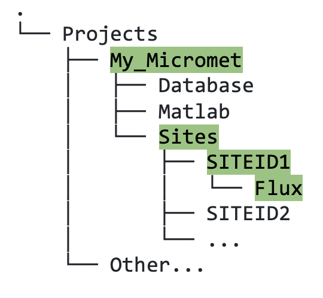
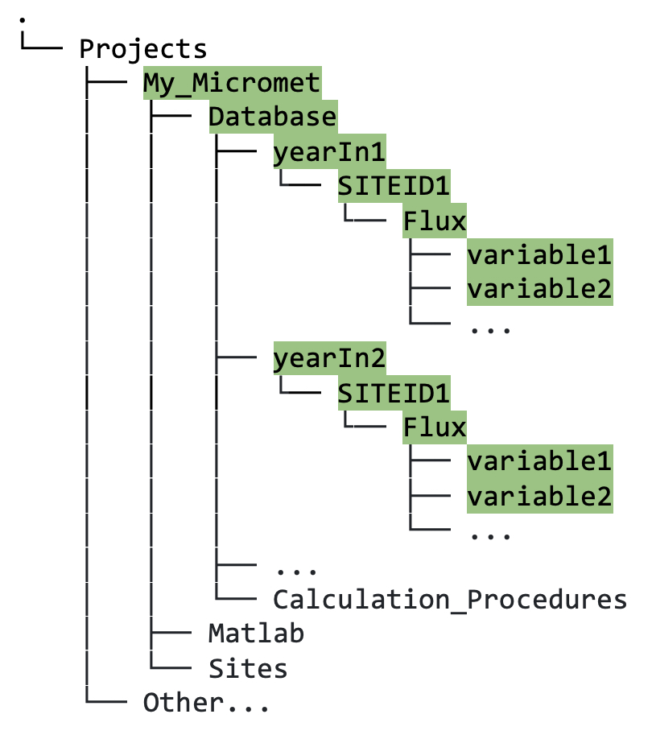

## 5.1. &nbsp; Quick Start: Create Database from Raw Data and Visualize Contents

This section gives you a quick-start example for converting EddyPro raw data output to a formatted dataset ready to be processed using the standardised libraries (i.e., `Biomet.net`). We also present some examples of how to quickly check the contents of your new database.

### Create Database

As previously mentioned, we will follow an example that focuses on flux-related EddyPro output data:

1. First, in your newly created `Sites` directory, within the relevant `SITEID`, create a new `Flux` folder (figure 11.1). 

    

    *Figure 11.1. Directory tree showing file path to the location where raw flux data for site with SITEID1 should be stored.*

2. Copy your EddyPro raw output data to this `Flux` folder. This data will remain untouched so that you always have a local copy of the original data.

3. In your `Matlab` folder, create one new "main" Matlab file that will act as a "do-it-all" script. The example given here (figure 11.2) &mdash; named `MyMicrometSitesCleaning_Main.m` (you can make your filename less generic but we advise including "Main") &mdash; will create the database, and later we will add the code for data cleaning: 

    
    
    *Figure 11.2. Matlab code to create database from raw EddyPro output.*

    This code can be copied from the code block at the bottom of this page. For instructions on how to convert other flux- and met-data formats, see section 12 [XXX link].

4. Next, run your "Main" Matlab program. Change any necessary input parameters (highlighted in peach), and you should see some data output in your `Database` directory. Data is grouped by year, then by site, then by data type, e.g., Flux (figure 11.3).

    

    *Figure 11.3. Directory tree showing file path to output in Database directory following database conversion.*

Your data is now in a format ready for cleaning using the pipeline.

### Visualize Contents of New Database

Here are some quick tips to inspect the Flux data from SITEID1 in your newly created database:

1. `gui_Browse_folder` function: 
```
pth = biomet_path(yearIn, 'SITEID1', 'Flux')
gui_Browse_Folder(pth)
```
This function opens a Matlab app that looks in the Flux folder for SITEID1 for a specific year (as defined in the `biomet_path` function input parameters) and plots each variable in turn. You can scroll through or use the dropdown in order to check that your data looks reasonable and as expected. 

2. Load one trace, e.g., co2_mixing_ratio and plot it. This example 
```
%% Load one trace and plot it
pth = biomet_path(yearIn,'SITEID','Flux');   
tv = read_bor(fullfile(pth,'clean_tv'),8);      % load the time vector (Matlab's datenum format)
tv_dt = datetime(tv,'convertfrom','datenum');   % convert to Matlab's datetime object
x = read_bor(fullfile(pth,'co2_mixing_ratio')); % load co2_mixing_ratio from SITEID1/Flux folder
plot(tv_dt,x)                                   % plot data
grid on;zoom on
```

3. `plotApp` function:
Simply type `plotApp` on the command line, and it will open an app that can compare traces from the same and different cleaning stages (once you have completed those), databases, and also produce statistical plots and outputs. More details of this and other visualization tools are described at length in section 14 [XXX link]. 


<br>
<hr>

"MyMicrometSites_Main.m" template script for copying:
```
%% Main function for MyMicrometSites data processing
% Created by <author> on <date>
% 
% ============================
% Setup the project and siteID
projectPath = '/Users/<username>/Project/My_MicrometSites/';
structProject=set_TAB_project(projectPath);
siteID = 'SITEID1';

%% Flux data
%
% Input file name
fileName = fullfile(structProject.sitesPath,siteID,'Flux','SMC_EDDYPRO_OUTPUT.csv');

% Parameters for reading EddyPro file 
timeInputFormat = {[],'HH:mm'}; 
dateColumnNum = [2 3];
colToKeep = [4 Inf];
structType = 1;
inputFileType = 'delimitedtext';
modifyVarNames=0;
VariableNamesLine = 2;       

% Read the file
[EngUnits,Header,tv,outStruct] = fr_read_generic_data_file(fileName,...
                                    [],[], dateColumnNum, timeInputFormat,colToKeep,structType,...
                                    inputFileType,modifyVarNames,VariableNamesLine);     

% set database path
databasePath = fullfile(db_pth_root,'yyyy',siteID,'Flux');

% Convert outStruct into database
missingPointValue = NaN;
timeUnit= '30MIN';
db_struct2database(outStruct,databasePath,0,[],timeUnit,missingPointValue,structType,1);
```

