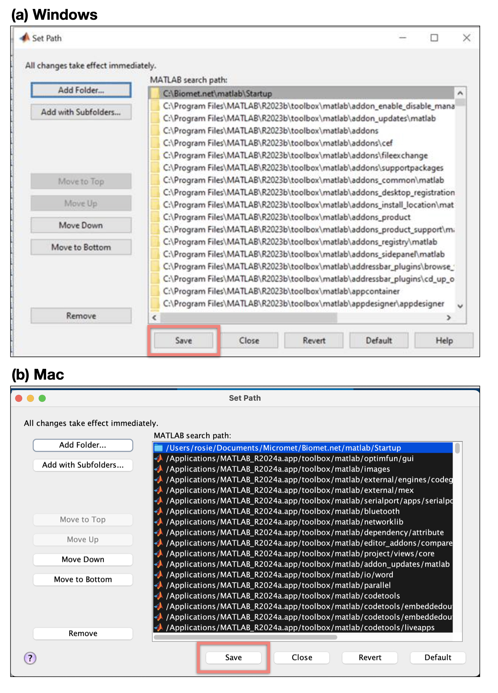

## Configure Matlab for Biomet.net library

Before completing this step, you must have the Biomet.net repository cloned to your local computer [link to Clone_Biomet_Library.md]. This step is important for ensuring the pipeline scripts and tools run successfully on your local computer. 

#### Instructions for configuring Matlab to work with Biomet.net:
* Once Biomet.net is successfully cloned, open Matlab.

* In “Home” tab, click “Set Path” menu option. The following screenshots show what your screen should be displaying at each step, for both Windows and Mac users:

    

* Select “Add Folder…” and navigate to the Biomet.net directory, then to `Biomet.net/matlab/Startup`. Click "Select Folder" (PC) or "Open" (Mac):

    

* At this point the Matlab path should look very similar to the next screenshot below [XXX change to figure numbers later for clarity]: only one folder in the path does not belong to Matlab nor the `/user/Documents/Matlab` folder, and that is the Startup folder you just added.

* Next, click “Save” to save these settings for the future. We recommend that no other folders are saved in the default path to avoid unintentional consequences when running the data cleaning. If the saving fails, if possible you should restart Matlab in admin mode and repeat the process (it is often a permissions issue at this point; see Troubleshooting [XXX link section] for more information).

    

* Now, you can *restart Matlab*. Following the restart, check the Matlab path (click “Set Path”) and it should have the Biomet.net library included, as shown in the figure below [XXX add figure number later]. In some instances you might also see “UBC_PC_Setup” but this may not appear in all installations - this will be automatically added only when required. Once confirmed, you can close this window, taking care not to change anything further.

    

Matlab is now ready to work with the Biomet.net library.
