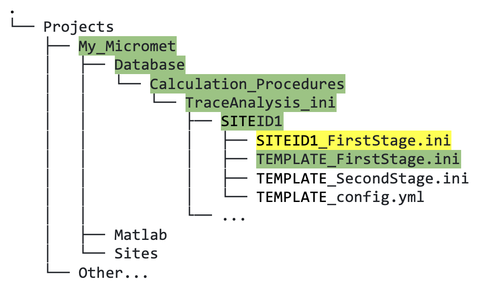

## 6.0. &nbsp; Quick Start: Download and Make Copies of Template Files and Edit Configuration File 

* <a href="https://github.com/CANFLUX/pipeline-documentation/raw/main/ini_templates/TEMPLATE_FirstStage.ini">First Stage Template INI file</a>
* <a href="https://github.com/CANFLUX/pipeline-documentation/raw/main/ini_templates/TEMPLATE_SecondStage.ini">Second Stage Template INI file</a>
* <a href="https://github.com/CANFLUX/pipeline-documentation/raw/main/ini_templates/TEMPLATE_config.yml">Third Stage Configuration file</a>

* <<a href="https://github.com/CANFLUX/pipeline-documentation/raw/main/ini_templates/TUT_config.yml">Third Stage Sample Configuration file for TUT site</a>

* Place holder for tutorial sample data: flux/met for TUT site.

 

1. Download the files above and put them in the location shown in figure 6.1:

    

    *Figure 6.1. Directory tree showing location of template INI files inside relevant SITEID folder.*

2. Make copies of *all three* files that begin "TEMPLATE" and rename the copies, replacing "TEMPLATE" with your site ID (`SITEID1` in this example; this filename format is required).

