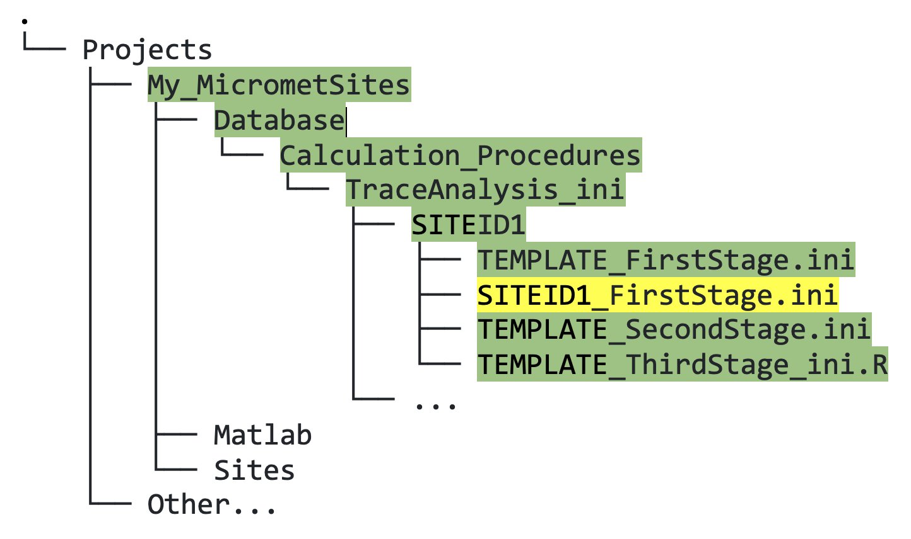

## 6.1. &nbsp; Quick Start: Create your First Stage INI File for Data Cleaning 

This section will show you how to start cleaning your data for stage one. In section 4.1 [XXX check link], when you ran the `create_TAB_ProjectFolders` function, this transferred a number of necessary files to begin cleaning, including one called `TEMPLATE_FirstStage.ini` (figure 6.1):



*Figure 6.1. Directory tree showing location of template INI files inside relevant SITEID folder.*

This example assumes you have already created a `Flux` and `Met` database for the same site (section 5.1 [XXX link]). 

1. First, make a copy of `TEMPLATE_FirstStage.ini`, then rename the copy, replacing "TEMPLATE" with your site ID (`SITEID1` in this example; this filename format is required).
2. Near the top of the file, insert the full name of your site (more descriptive is better), your site ID, and the timezone information. 
3. Next, scroll down (skipping "Global Variables" sections for now) to where you see:
    ```
    %----------------------------------------------------
    %--> Insert met variables here
    %----------------------------------------------------
    ```
    Beginning with air temperature, define the input data to each trace given in the INI file. For example, if you have an output variable that represents your 2-m air temperature measurement named `MET_HMP_T_2m_Avg`, you would assign this variable name to the `inputFileName` parameter (figure 6.2; yellow highlighted text). During this first cleaning stage it will be renamed as `TA_1_1_1` using the `variableName` parameter, following the <a href="https://ameriflux.lbl.gov/data/aboutdata/data-variables/" target="_blank" rel="noopener noreferrer">Ameriflux naming convention</a>. 

    

    *Figure 6.2. Air temperature trace as defined in a first stage INI file, with input from `MET_HMP_T_2m_Avg` variable.*

    Other fields that need editing are highlighted in peach: 
    - Give a descriptive title to your trace;
    - Input the start date of measurements for this variable in matlab's datenum format (YYYY,MM,DD);
    - Check the units;
    - If known, input the instrument model and serial number (SN);
    - Importantly, *choose minMax bounds* that are appropriate for the climate of your site (values outside this range will become NaNs);
    - See full documentation (section 6.4) for details of all the parameters and their definitions. 

<br>

4. Once you have done this for a few variables, test the data cleaning in Matlab, using the `fr_automated_cleaning.m` function as follows:
    ```
    fr_automated_cleaning(yearIn,'SITEID',1)
    ```
    where yearIn (YYYY) is the year of data you want to clean (it is possible to clean multiple years at once but we will keep things simple with one year for now), SITEID would be SITEID1 from the earlier example, and '1' represents stage one of data cleaning.

    Provided everything worked with no errors, you should now see output data in a new `Clean` folder within your `Met` folder.

 5. If you do *NOT* have a four-component net radiometer such as a CNR4 at your site, you can skip all of step 5 and go to step 6. If you do have a CNR4 or similar, we have provided an "include" INI file that loads relevant radiation variables for you. *We advise that you do not edit this or any other include file.* Instead, scroll to the bottom of your site-specific INI file where the include files are called.

    a. Uncomment the line containing `RAD_FirstStage_include.ini`, so that the block of code looks like this:
    ```
    %------------------------------------------------------------------------------------
    % Call #include ini files
    %------------------------------------------------------------------------------------
    %--> Must be at end of .ini file
    %--> Comment out include files that are not needed
    %#include EddyPro_Common_FirstStage_include.ini
    %#include EddyPro_LI7200_FirstStage_include.ini
    %#include EddyPro_LI7500_FirstStage_include.ini
    %#include EddyPro_LI7700_FirstStage_include.ini
    #include RAD_FirstStage_include.ini
    ```
    Recall that this file is read by Matlab, so comments are created using `%`; the `#` sign must be present to call the include file. 

    b. Next, scroll almost to the top of the file where you see:
    ```
    %------------------------------------------------------------------------------------
    % Global variable specification (trace-specific)
    %------------------------------------------------------------------------------------
    %--> Radiation sensor information: 
    %--> If using CNR4 with RAD_FirstStage_include file, add inputFileNames etc., for example:
    %globalVars.Trace.SW_IN_1_1_1.inputFileName 			 = {'MET_CNR4_SWi_Avg'} 

    globalVars.Trace.SW_IN_1_1_1.inputFileName 			    = {''} 
    globalVars.Trace.SW_IN_1_1_1.inputFileName_dates 	    = [datenum(1900,1,1) datenum(2999,12,31)] 
    globalVars.Trace.SW_IN_1_1_1.instrument 			    = 'CNR4'
    globalVars.Trace.SW_IN_1_1_1.instrumentSN 			    = ''
    ```

    For `SW_IN_1_1_1` (incoming shortwave radiation), add:
    - The inputFileName from your database;
    - Edit the start date for your data record in inputFileName_dates;
    - Edit instrument (if necessary); and 
    - Add the serial number (instrumentSN). 
    
    All these parameters are used for the other radiation variables defined below this one, apart from inputFileName, which you will need to input for each variable. Also, if you have a PAR radiometer you can use the PPFD global variables in this radiation section in the same way. 

    c. Run `fr_automated_cleaning(yearIn,'SITEID',1)` again to test this change. This step will add the radiation variables into the same `Met` folder as in step 4.

 6. Next, we will clean your `Flux` variables. As previously mentioned if you followed step 5, we have provided "include" files that load most information on common traces for you.

    a. To use these files scroll to the bottom of your first stage INI file. Let's assume you are using a LiCor LI-7200 and LI-7700 at your site. Then you would uncomment the relevant include files, as follows:
    ```
    %------------------------------------------------------------------------------------
    % Call #include ini files
    %------------------------------------------------------------------------------------
    %--> Must be at end of .ini file
    %--> Comment out include files that are not needed
    #include EddyPro_Common_FirstStage_include.ini
    #include EddyPro_LI7200_FirstStage_include.ini
    %#include EddyPro_LI7500_FirstStage_include.ini
    #include EddyPro_LI7700_FirstStage_include.ini
    %#include RAD_FirstStage_include.ini
    ```
    For all IRGAs, you need to use `EddyPro_Common_FirstStage_include.ini`, then also uncomment the lines for your specific IRGA(s).

    b. Now scroll up to:
    ```
    %---------------------------------------
    % Global variables (instrument-specific)
    %---------------------------------------
    ```
    Enter/edit the relevant parameter details for your IRGA(s) (instrument, serial number, start date of measurements). Do the same for your anemometer and full eddy-covariance (EC) system instruments (e.g., CSAT3 plus IRGA). 'otherTraces' includes all instrument types not previously defined within global variables, and must be enabled, with measurement record dates defined.

    c. Run `fr_automated_cleaning(yearIn,'SITEID',1)` again to test this addition. You should see your first-stage cleaned data appear in a new `Clean` folder within your `Flux` folder. 

7. At this stage, you can start to add any `Met` or `Flux` variables that may not already be included in the template files. Also, for example, if you have more than one air temperature measurement, you would create more traces to assign these, and use the Ameriflux naming convention to distinguish and define their relative positions (figure 6.3).

    

    *Figure 6.3. Second air temperature trace defined in the same first stage INI file, in this case for a different vertical position (height of 350 cm), with input from `MET_HMP_T_350cm_Avg` variable.*

**TIPS**
<ul>
   <li>Pay attention to the output display, it is informative.</li>
   <li>We recommend using the "quick-look" visualization tools at any stage of cleaning to check your data looks as expected (e.g., the filenames are correct and the values conform to your minMax bounds).</li>                                                               
</ul> 


See section 6.4 [XXX link] for more guidance on this and INI files in general. For cases where you do not have input data for all traces defined in any include file that you use, see section 8.1 on Troubleshooting [XXX link].

