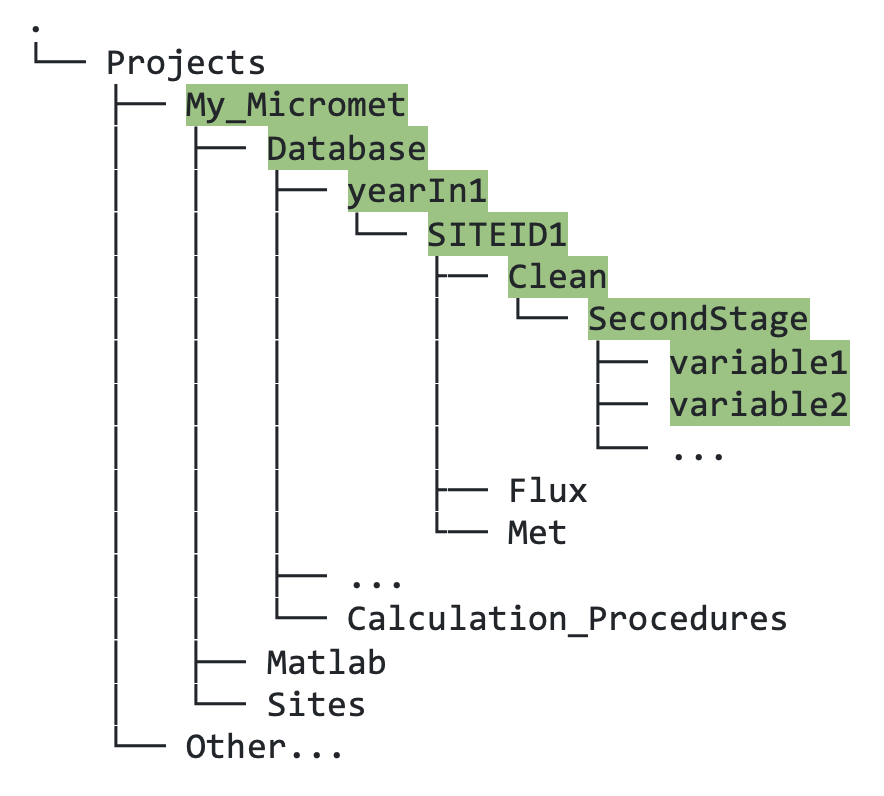

## 6.2. &nbsp; Quick Start: Create Your Second Stage INI File for Data Cleaning 

This section will show you how to create your second stage INI file, in order to carry out the second stage data cleaning. The following steps assume that you have already created a first stage INI file for your flux site.

1. As with the first stage, make a copy of `TEMPLATE_SecondStage.ini`, then rename the copy, replacing "TEMPLATE" with your site ID (`SITEID1` in this example; this filename format is required).
2. Near the top of the file, insert the full name of your site (more descriptive is better) and your site ID. 
3. The `TEMPLATE_SecondStage.ini` file provided already includes a set of fundamental climate variables. We advise testing the file with only these variables first. Note that even if you are not changing anything in the second stage, you must still include any variable that you wish to be available for the third stage (and beyond, e.g., Ameriflux submission), i.e., they must be "passed through".
4. Test the second stage data cleaning in Matlab, as follows:
    ```
    fr_automated_cleaning(yearIn,'SITEID',2)
    ```
    Note the input parameter `2` instead of `1`, denoting second stage. You should see a new `Clean` folder directly under the site ID directory in your Database, for whichever year(s) you ran it for. Within that `Clean` folder, there will be a `SecondStage` folder (figure XXX).

    

    *Figure 6.4. Directory tree showing location of data output (in this example, variable1, variable2, ...) from second stage cleaning.*

5. You can add any more relevant variables into the second stage INI file. Again, use the visualization tools to check your data looks as expected, then you are ready to progress to third stage cleaning.

[XXX add fluxes to template? needed for third stage example?]

### Quick summary of second stage features
1. Combine multiple traces into one using the `calc_avg_trace` function. These traces *must* already have been defined in the first stage.
2. Use the "Evaluate" option to operate on your input traces.

Example: the `TA_1_1_1` trace you defined in the first stage has some missing data and there is a nearby reliable climate station with a long record. In the first stage you also defined (and filtered etc.) data from this climate station in a variable called `TA_ECCC`. Then in the second stage, you can use `calc_avg_trace` within the `Evaluate` parameter, as follows:
```
Evaluate = 'TA_1_1_1 = calc_avg_trace(clean_tv,TA_1_1_1,TA_ECCC,-1)';
```
The function regresses the two variables provided and uses the resulting linear fit to fill the gap(s) in the first variable. For more details on second stage cleaning see the full documentation section 6.5 [XXX link]. Note that fluxes are gap-filled in stage three. 
