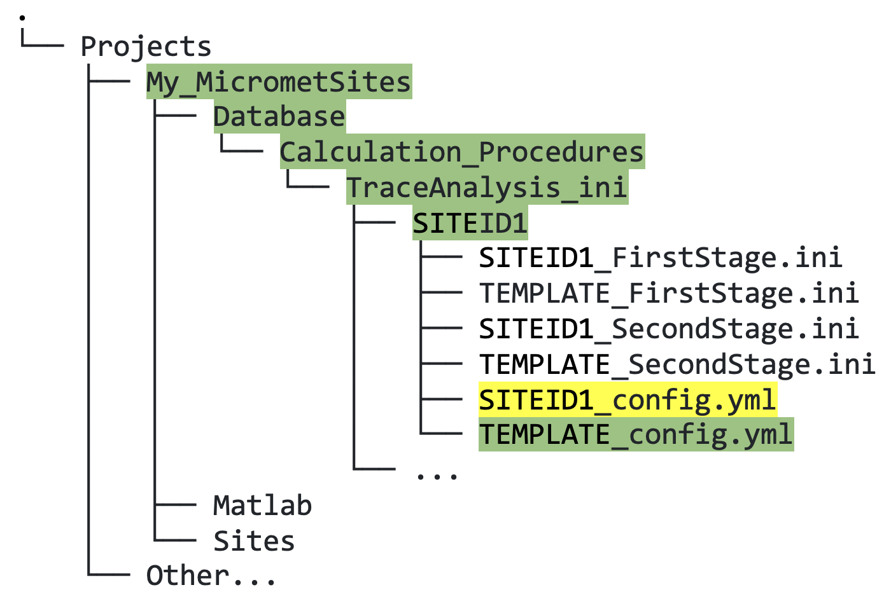
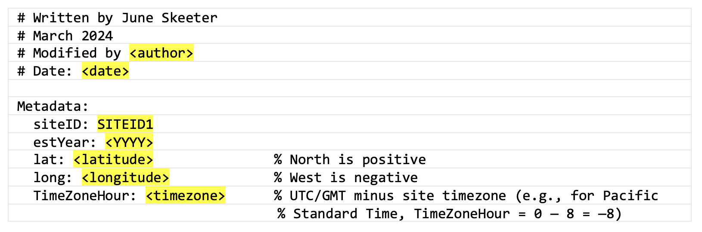

## 6.3. &nbsp; Quick Start: Third Stage Cleaning and Converting to Ameriflux Output

The third stage cleaning requires the least amount of work by the user, but is usually the most computationally intensive stage, as it includes running models for gap-filling fluxes. Again, the following example assumes you have already completed first and second stage cleaning for one site.

1. Make a copy of the `TEMPLATE_config.yml` file that we provided (figure 6.5) and rename the copy with your site ID. 

    

    *Figure 6.5. Directory tree showing location of third stage custom YAML file that must be copied (green highlighted text) and edited (yellow highlighted text).*

2. At the top of your site-specific file, input the site ID, the year that measurements at the site began, and the metadata for your site (figure 6.6; yellow highlighted text):

    

    *Figure 6.6. Third stage site-specific custom YAML file showing which fields to edit in yellow highlighted text.*

    The main configuration file (`global_config.yml`) for running third stage cleaning is located in the `TraceAnalysis_ini` directory, and generally speaking this should not be edited (see section 6.6 for more information on adding custom configuration).

3. Next, test the third stage data cleaning in Matlab; remember that it can take a lot longer to run than first and second stages. Note that the cleaning stage argument for third stage cleaning is `7` (*not* 3; this is a legacy artifact), as follows:
    ```
    fr_automated_cleaning(yearIn,siteID,7)  % third stage
    ```

### Output your data to an Ameriflux CSV file
Finally, once you have inspected your clean data and are happy with your INI files, you can output the data to a CSV file formatted for submission to Ameriflux:
```
fr_automated_cleaning(yearIn,SITEID,8)  % Ameriflux CSV output
```

Finally, you can run all stages at once (or a subset, provided the previous stages to the subset have already been run):
```
fr_automated_cleaning(yearIn,SITEID,[1 2 7 8])  % all three stages plus Ameriflux output
```