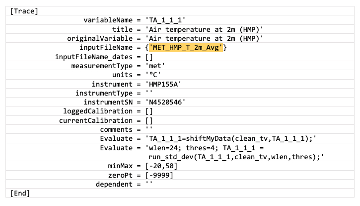
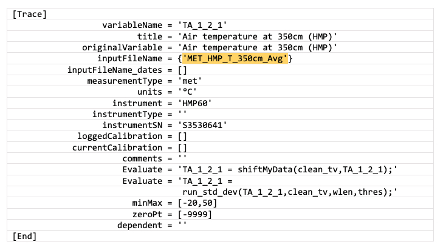

## 6.2. &nbsp; Full Documentation: Creating Your First Stage INI file, Global Variables, Include Files, and Tags

[XXX In Progress]

[XXX is outlier detection worth mentioning here as feature, and if so, where?]

### What are INI files?
The INI files for a given flux site dictate how data is transferred from its raw format into a standardized, cleaned, and gap-filled format that can be used for scientific analysis. They provide instructions to a set of MATLAB and R scripts used to process data. Even though flux sites can be similar in set up, they are usually unique in some way (different sensors, loggers, record lengths, etc.), and the INI files provide a way to deal with these differences while standardizing the data across sites.

The files are separated into three stages in accordance with each data cleaning stage. Before starting to create your own INI files, it is important that you complete sections [XXX add section numbers once finalized, or link all sections - though there are a lot of bitesize steps before this one now], so that you have the best chance of everything running smoothly. 

To help you create and edit your own site-specific INI files, throughout the instructions we refer to a working example that cleans data from the Delta Salt Marsh (DSM) flux site in British Columbia [XXX revisit once sample site is decided upon]. You should already have obtained all the sample files for this site??? and put them in the appropriate locations [XXX link to Obtain_Sample_Config_Standardization_Files.md].

### Instructions to create your own INI files:

#### *First Stage INI file*
These are the steps to create your first stage INI (which generally requires the most work of the three INI files):

[[XXX move this createFirstStageIni to later as an option - instead duplicate DSM files and rename... Create first stage cleaning INI file from template using `createFirstStageIni`]

* Using your duplicated first stage INI file (you did this in section XXX [link Obtain_Sample_Config_Standardization_Files.md]), name it using the unique measurement site ID, e.g., SITEID = ‘DSM’ INI file is named `DSM_FirstStage.ini`.
* Edit first stage INI file adding *just a few variables at a time*, keeping in mind the following, as well as the data cleaning principles previously outlined [XXX link to Data_Cleaning_Principles section?]:

    1. Select traces that are needed for future data analysis. Not all the measured variables from a site need to be here, only the ones that will be used in future analysis or those needed to improve cleaning, such as diagnostic variables.
    2. Filenames from the database can be renamed here. The trace name does not have to be the same as the file name from the database, and should follow [Ameriflux guidelines](https://ameriflux.lbl.gov/data/aboutdata/data-variables/) including positional qualifiers where relevant.
    3. The original values can be altered; calibrations can be applied, units can be changed.
    4. Apply basic filtering: 
    (a) values can be removed if they exceed minMax thresholds;
    (b) values can be clamped to the thresholds if they exceed clampedMinMax values. 
    5. This stage creates dependencies between different traces. If one trace gets some points removed here, all its dependent traces will have those points removed too. 
    6. More complex user-defined processing can be applied to the trace using the "Evaluate" option (also available, and very useful, in stage two). User-written Matlab functions can be called from this statement. Multiple Matlab statements can be called from within the “Evaluate” string. Some rules for formatting apply here (see the existing SecondStage ini file for details and examples).

    As an example, if you have an output variable from a Campbell Scientific data logger that represents your 2-m air temperature measurement named `MET_HMP_T_2m_Avg`, you would assign this variable name to the `inputFileName` parameter (figure XXX; yellow highlighted text). In this example, it would be renamed in this stage using the `variableName` parameter, as `TA_1_1_1`, following the [Ameriflux naming convention](https://ameriflux.lbl.gov/data/aboutdata/data-variables/). 

    

    If you have more than one air temperature measurement, you would create more traces to assign these, and use the Ameriflux naming convention to distinguish and define their relative positions (figure XXX).

    

<br>

* Once you have a few variables in your INI file, test it by running the `fr_automated_cleaning.m` function in Matlab (part of Biomet.net library):

    Arguments for `fr_automated_cleaning` function:
    | Field | Description | Type |
    | ----- | ----------- | ---- |
    | yearIn | year to clean data for | integer |
    | SITEID | measurement site ID, e.g., DSM | string uppercase |
    | cleaning stage to run | 1 = first stage, 2 = second stage, 7 = third stage, 8 = convert to AmeriFlux CSV file | integer |

* For example, to run first stage cleaning for the DSM site for 2022, you would type: `fr_automated_cleaning(2022,'DSM',1)`.

* With this function, you can clean multiple years of data, e.g., `2020:2023`, and once you have your INI files set up for later stages you can also run multiple stages e.g., `[1 2 7]`. Earlier stages must have been run at least once before running subsequent stages so the appropriate data files exist for the next stage. 

##### First stage INI file properties
| Field      | Description |
| ----------- | ----------- |
| Header/Comments      | “%” character indicates the beginning of a comment. Program will not process any characters that follow “%”. Use comments to add information and to better document the site. Each line of the INI file can be followed by a comment. Refer to the sample INI file for DSM site.      |
| Site_name   | Name of the site. Any text can go here.        |
| SiteID      | This is the name attributed to the site in the database (e.g., DSM). Must be uppercase. |
| Difference_GMT_to_local_time | Time difference between GMT time, that database is kept in, and the standard time at the site location. `local_time+Difference_GMT_to_local_time -> GMT time`. |
|[Trace] | Marks the beginning of a new variable. The section has to end with the keyword `[End]`.|
| variableName | Name of variable for first stage, following the Ameriflux naming convention. The variable with this name will show up in the subfolder “Clean” under the same folder where the original database file came from. |
| title | Descriptive variable name for plots/visualization.|
|inputFileName |{`inputFileName`} The name of the database file that contains data for this trace. The brackets are mandatory.<br /> The file name can include folder(s), e.g., `'Met/Tair'`, and the paths are relative to the main site path (`./Database/yyyy/SITEID`), so the above example translates into this filepath: `'./Database/yyyy/SITEID/Met/Tair'`.<br />Over the lifetime of a measurement site, the data logger programs can change and a sensor measurement that was assigned to a variable may change. To allow for different variable names over the site history the inputFileName can be given as: {`'inputFileName1','inputFileName2'`}. In this case, the parameter `inputFileName_dates` must be present and reflect this (see next parameter description).<br /> Advanced: if there is a need to load up a data file from an alternative site, the path can be constructed as follows: `../../SITEID2/dataFolder`. This syntax `../../` moves the path pointer up two directory levels to `/Database/yyyy` and from there `SITEID2/dataFolder` takes the program to the correct folder.|
|inputFileName_dates |`[datenum_start1 datenum_end1; datenum_start2 datenum_end2]` The start and end dates of data periods for each of the inputFileNames, using the Matlab `datenum` function. <br />If there are multiple inputFileNames per the example in the previous parameter description, e.g., {`'inputFileName1','inputFileName2'`} then the program needs to know the time periods when the data assigned to the variableName should come from `inputFileName1`, and when from `inputFileName2`. In that case, this field is mandatory.<br /> If the inputFileName parameter contains only one file name, this inputFileName_dates parameter is optional, but it is still a good practice to use it anyway for documentation purposes and in case other filenames are added in the future.<br /> The last `datenum_end` is usually set far into the future, e.g., `datenum(2999,1,1)`.| 
|measurementType| Usually `'Met'` or `'Flux'` (must be of Matlab type char). Mandatory parameter that sets the input and output trace folders. The input folder defaults to: `SITEID/measurementType/inputFileName`. If relative paths are used [XXX used where?] they "assume" that the current folder is `SITEID/measurementType` so the relative path is referenced to that [XXX unsure what this sentence means]. The output folder for the first stage cleaned trace is always `SITEID/measurementType/Clean`. <br />Note: the measurementType must *not* be missing (empty), otherwise the data will be saved to `SITEID/Clean/variableName` which is incorrect and will cause errors in future cleaning stages.|
|units|Measurement units for this trace, must be data type char. Important!|
|instrument|The name of the sensor that measures this trace, e.g., `'HMP155A'`|
|instrumentSN|Serial number of the sensor, if available.|
|Evaluate | Optional user defined function. Examples: can be used to derive variables from available data; in flag variables to remove bad data; or for calculating new useful variables, e.g., `Evaluate = 'global_potential_radiation = potential_radiation(clean_tv,<lat>,<lon>);'`. See sample file `DSM_FirstStage.ini` for more use cases.|
|loggedCalibration|Used together with currentCalibration (see next parameter). If you need to change the linear calibration for the trace, these coefficients are used to convert the trace values from engineering units to its original/raw units. Then the correct calibration coefficients (currentCalibration) are used. This can also be used to change the units. The format is `[gain offset startDatenum endDatenum]`, where `startDatenum` and `endDatenum` refer to the time span that this particular set of coefficients should be applied. For example, with no change for data starting on 1 January 2020, the code would read `loggedCalibration = [1 0 datenum(2020,1,1) datenum(2999,1,1)]`. You can apply multiple calibrations to different time periods, separated by semicolons.<br /> Note: all calibration values need to be on the same line of code, i.e., no line-breaks are allowed in the INI file!|
|currentCalibration|Correct(ed) linear calibration coefficients. Used together with loggedCalibrations (see notes for previous parameter for more details). |
|comments|Any useful comments relating to this trace and its handling in the INI file, such as why certain flags are applied.|
|minMax|`[min max]` Minimum and maximum numerical thresholds for filtering. The values *outside* of this range will be set to NaN.|
|clamped_minMax|`[cMin cMax]` Similar to minMax but instead of setting the data points outside the range to NaN, it truncates their value to the cMin or cMax. (e.g., RH: [0 100]).<br />Note: this parameter is not mandatory, however, when used, please make sure that the minMax property boundaries are wider than the boundaries of clamped_minMax because the minMax property is applied first. This parameter is useful for variables such as relative humidity, e.g., `minMax = [-1 110]` used with `clamped_minMax=[0 100]`.|
|zeroPt| Value to indicate missing data. Many programs nowadays use -9999 to indicate bad/missing data points.|
|dependent|Filter-dependent variables based on specified trace. The current trace can have multiple dependents that need to be separated by commas, e.g., `dependent = 'trace1','trace2','trace3'`.<br />For example, when using the LI-7200 pump, all the traces that depend on the LI-7200 are dependent on the pump trace. So, for the LI-7200: `dependent = 'CO2','H2O'`. Then the CO2 trace should have `dependent = 'FC',...` and so on. You can write these out manually where necesssary but we highly recommend using the "tags" feature for common dependencies [XXX link to subsection on tags]. Avoid circular references, i.e.,  CO2: `dependent = 'FC'` together with FC: `dependent = 'CO2'` is bad! [XXX is it?!]|
|[End]|Marks the end of the trace properties section.|

<br>
**Note:**
Other properties that a user wants to use later on in their own programs (or in the “Evaluate” statements) can be added to each of the traces. The function that processes the INI files (read_ini_files.m) will add the property and its assigned value to the trace structure but the rest of the Trace Analysis programs will ignore it. The user can then parse the trace info in their own programs (or within “Evaluate” statements) and take advantage of this feature.

<br>

##### Tags for Dependent Variables
As mentioned in the "dependent" parameter description in the properties table, you can use the tags feature to ensure that your INI file "catches" all common dependent variables. This feature utilizes the Biomet library function `tags_Standard.m`.  You should list the relevant tag in the dependent field for it to work. 

For example, given the standard tags, if you put `'tag_H2O_All'` in the dependent field for a trace, all traces listed under that tag will then be a dependent of that trace. Tags can refer to other tags. You can also create site-specific custom tags by creating a `SITEID_CustomTags.m`, making sure to follow the same format as the tags in `tags_Standard.m` (see section XXX for the location where this optional file should live). 

Tags in your site-specific custom file will overwrite tags of the same name in the `tags_Standard.m` file, and Matlab will warn you that this is occurring (by beeping and writing out a message to the screen).


##### Global Variables and "Include" Files

[XXX add info about including minMax parameter values in global variables (once implemented)]

At the top of the first stage INI sample file that you obtained (`DSM_FirstStage.ini` XXX check site name once decided), you will notice sections with headers containing "Global Variables". To simplify entering and editing the required parameters into the first stage INI file there is an option to apply the same setting to many traces at once, using this global variables feature. These are always defined at the beginning of the first stage INI file. 
 
The main advantage of this feature is that it allows you to define a standard set of variables in templates called "include" files, which can be loaded into each site-specific INI file using the `#include` statement. 

Another advantage is that you can apply changes to multiple traces all at once if needed, by making only one edit at the top of the file and then referencing this addition. This way, you do not risk missing out multiple traces needing the same edit, so long as it is referenced correctly. 

Note: only the main body of your first stage INI file, *not* your "include" files, should contain global variables.

There are three types of global variables, as follows:

a. Instrument-specific (`globalVars.Instrument`): 
* For the *instrument-specific* global variables, each trace has an `instrumentType` field. Currently we use five default instrument types (six if we consider an empty field `[]` as a type): LI7200, LI7700, Anemometer, EC, and otherTraces. 
* Example: `globalVars.Instrument.LI7200.instrumentSN  = '72H-1029'` applies this serial number to every trace which includes `instrumentType = 'LI7200'`.
* You can also create your own unique sensor option for `instrumentType`, if you need to apply a setting to multiple traces. If `otherTraces` is enabled (`otherTraces.Enable = 1`) these settings are applied to *all* traces not defined under any other groups, or the ones that have `instrumentType=[]`. Future improvements to global variables include adding a MET type [XXX does this last sentence need including for the user? or just a reminder for us?]

b. Trace-specific (`globalVars.Trace`): 

* Example: `globalVars.Trace.CH4.currentCalibration = [1000 0 datenum(2021,1,1) datenum(2999,1,1)]` applies this current calibration to the trace with `variableName = 'CH4'`. 
* Detailed explanation: in the INI file, the trace "CH4" has the field `currentCalibration` set to empty: `currentCalibration = []`. There is a global variable for the same trace with the correct `currentCalibration` field:
`globalVars.Trace.CH4.currentCalibration = [1000 0 datenum(2021,1,1) datenum(2999,1,1)]`. The final result is that the field `currentCalibration` for the trace "CH4" gets set to: `currentCalibration = [1000 0 datenum(2021,1,1) datenum(2999,1,1)]`.

c. Other (`globalVars.other`):
* For the third type of global variable, e.g., `globalVars.other`, currently you can use this to carry out single-point interpolation, for cases where just one half-hourly data point is missing:
    ```
    globalVars.other.singlePointInterpolation = 'on'  % 'no_interp' - skip interpolation [default], 'on' - do single missing point interpolation for all traces
    ```


*How the global variables algorithm works:*
1. The INI file trace parameters, i.e., all fields between [TRACE] and [END] in the INI file, are loaded up.
2. The program then cycles through all the traces: for each trace, first it checks if the `instrumentType` field matches one of the `globalVars.Instrument` fields, e.g., for `instrumentType = 'LI7700'` measuring "CH4", if there is a `global.Instrument.LI7700` field, then all its fields would be applied to the CH4 trace, either creating a new field or overwriting the existing fields; i.e., the content of `global.Instrument.LI7700.instrumentSN` would replace the content of the CH4 field `instrumentSN`. Secondly, it checks if the trace `variableName` matches any of the `globalVars.Trace` fields, e.g. Trace "CH4".
3. The program continues reading the INI file and applies all the settings from the [TRACE]-[END] section.
4. Next, it cycles through all the `globalVars.Instrument` fields and creates the fields, or overwrites them if they already exist.
5. Finally, it through all the `globalVars.Trace` fields and creates or overwrites the fields.
6. Then the program moves to the next trace and repeats steps 2–5.


##### Adding **`include` files to your First Stage INI file**

In section [XXX 12_Obtain_Sample_Config_Standardization_Files.md] we introduced `include` files and how to obtain them. These template files define a standard set of variables that can be loaded into your first stage INI file. Specifically, the files relate to EddyPro output and radiation components. We suggest browsing through these files to become familiar with the content. If you wish to change or add any settings, we strongly recommend leaving the template "include" files untouched and using the global variables feature to create or overwrite the relevant setting, as described above [XXX global variables section].

More information about include files:
* `EddyPro_Common_FirstStage_include.ini`: includes traces common to EddyPro output, listed in EddyPro file output order;
* `EddyPro_LI7200_FirstStage_include.ini`: when an LI-7200 IRGA is being used, this file adds LI-7200 specific traces, listed in EddyPro file output order;
* `EddyPro_LI7500_FirstStage_include.ini`: when an LI-7500 IRGA is being used, this file adds LI-7500 specific traces, listed in EddyPro file output order;
* `EddyPro_LI7500_FirstStage_include.ini`: when an LI-7500 IRGA is being used, this file adds LI-7500 specific traces, listed in EddyPro file output order;
* `RAD_FirstStage_include.ini`: includes radiation components. 

To include any of these files, add the following line of code to the very bottom of your first stage INI file: `#include <relevant_file>_include.ini`. If you are using more than one, put them on multiple lines of code, still at the very bottom of the INI file, as follows:
```
#include EddyPro_Common_FirstStage_include.ini
#include EddyPro_LI7200_FirstStage_include.ini
#include RAD_FirstStage_include.ini
```

<br>
<hr>

**Note for first and second stage:** [XXX not sure if this belongs here or elsewhere] Here are some programming rules that you must follow for the INI files to be successfully read by the pipeline scripts:
```
Programming Syntax Rules for First and Second stage INI files:

1. We enforce using uppercase for site IDs to avoid problems between running data cleaning on Mac vs. Windows.
2. All traces must be enclosed in [Trace] and [End] blocks.
3. All assignments can be on multiple lines, but should be enclosed in single quotes.
4. Comments must begin with a percentage sign (%).
5. All fields must be in Matlab format.
6. All parameter assignments must be to strings in single quotes, or numeric expressions, e.g., threshold_const = 6, threshold_const = [6], variableName = 'Some Name'.
7. For the first stage, the partial path must be included with the inputFileName when you locate the raw data trace in the database. (Using biomet_path function only returns the path: /year/SITEID/measType/)
8. First stage necessary fields are: variableName, inputFileName, measurementType, units, title, and minMax.
9. Second stage necessary fields are: variableName, title, units.
```

