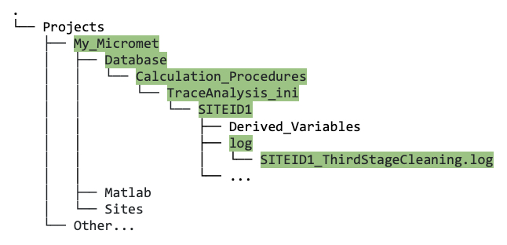

## 7. &nbsp; Troubleshooting, FAQ, and Special Cases

<link rel="stylesheet" href="css/style.css">

This section presents some general troubleshooting tips outlining things to check to make sure the pipeline scripts will run smoothly. There are also some FAQ, and some guidance on special cases and how to handle them.

Note that this section is a work in progress and will continue to be updated as the pipeline is further developed and tested.

On this page:
- <a href="#div_id_Troubleshooting">Troubleshooting: some general tips</a>
- <a href="#div_id_FAQ">FAQ</a>
- <a href="#div_id_SpecialCases">Special cases</a>

 

### Troubleshooting: some general tips

* When running data cleaning (any stage), pay very close attention to the output on your screen. It tells you when everything runs smoothly, and if something goes wrong, in most cases it will be informative as to why and whereabouts things went wrong. 
* Avoid having extra white space in your INI file between `[TRACE]` and `[END]`. Each parameter must be defined on a new line, with no wraparound. We recommend using a text editor that has line numbers (such as VS Code) to help you avoid and/or diagnose this issue.
* Regularly (once or twice a week) pull or re-download the <a href="https://github.com/CANFLUX/Biomet.net" target="_blank" rel="noopener noreferrer">Biomet.net library</a> to make sure you have the most up-to-date version. 
* Regularly check the following git repo to make sure you have the most up-to-date include files: <a href="https://github.com/CANFLUX/TAB_include_files" target="_blank" rel="noopener noreferrer">TAB_include_files</a>.
* If you downloaded the Biomet.net library (rather than cloned it), make sure that you renamed it `Biomet.net` since the download includes "main" in the folder name.

 

### FAQ

<!-- Could eventually group these by stages etc. -->

1. *I have multiple files containing data from one site, e.g., daily, monthly, or annual files. How do I create one database from all my files?*

    * See section 5.2: "Creating Database From Multiple Input Files and Updates for Continuous Operational Sites".

2. *I have multiple flux sites. Once I've added one site and created my database with data from that site (and cleaned it, etc.), what are the steps to move on to my next site?*

    * See section ...

3. *How do I incorporate data from other sources such as nearby climate stations, e.g., for gap-filling, into my database?*

    * See section 5.2: "Create database using data from Canadian meteorological stations" for Canadian station data. We are developing processes for including U.S. station data, and also ERA5 reanalysis data.

4. *When I run the third stage cleaning, why does it finish so quickly (less than a minute), and/or why is there is no data output in the* `Database` *directory?*

    * Check the log file that is produced automatically when running the third stage (`SITEID1_ThirdStageCleaning.log`). It is informative and will usually tell you the issue; it is located here:

        

        *Screenshot showing the location of the third stage log file.*

    * Check that all R packages are installed and loaded. Refer to the code provided in section 2.5 for this.

    * Check that after you downloaded and unzipped the `Biomet.net` library, you renamed it from `Biomet.net-main` to **`Biomet.net`**.

5. *I'm having issues when running `fr_read_TOA5_file_new.m` to load my met data into a new database.*

    * Check that variable names are all in line 2 in your raw data file. 

 

### Special Cases

This section outlines some recurring special cases and how to deal with them:

1. *There is a variable defined in an include INI file that I have no raw input data for.* 

    In this case, you can add the following code to the global variables section of your first stage INI file. Remember to change the name of the "dummyVariable" to match the name of the variable you do not have.

    <pre>
    %-->Avoiding errors due to missing input files 
    dateRangeNoData = [datenum(1900,1,1) datenum(1900,12,31)]
    globalVars.Trace.dummyVariable.inputFileName_dates = dateRangeNoData</pre>
    E.g., if you are running data cleaning for the year 2023, this code essentially tells the pipeline that for this "dummyVariable", no data exists for 2023 (and only exists for the year 1900), and the program will continue smoothly with no errors.

2. *I am using an earlier version of Matlab than 2023b, and I'm getting an error when running the `create_TAB_ProjectFolders` function. How do I fix this?*
    
    Download <a href= "directory_setup/My_Micromet_Folder.zip">this zip file</a>, unzip, and put the *contents* of the unzipped directory within your own project directory; make sure your directory structure looks like figure 4.1 (in section 4.1). 

    The `gitclone` function is used within the `create_TAB_ProjectFolders` function to transfer (clone) the directory structure and files within. However, `gitclone` was only added to Matlab 2023b, so you need to download this project directory structure directly.

    If it is an error related to `gitclone`, the error will occur on the line that gitclone is called, so you can check this in the error message, e.g., it may look like this:
    <pre>Error: <u>File: create_TAB_ProjectFolders.m Line: 66 Column: 32</u>
    Incorrect use of '=' operator. To assign a value to a variable, use '='. To compare values for equality, use '=='.</pre>

    <!--Ideally, you would update your Matlab version if possible, since we may make edits to the directory structure/set-up in the future... Not sure how we are handling this even for those using gitclone?? -->

3. *After running third stage cleaning, my output files following u-star filtering do not contain the month of December (or the last month in a particular three-month period).*

    * U-star filtering uses meteorological seasons by default: DJF, MAM, JJA, SON. This likely means you are missing met data for the full season in which the month is missing. Check your second stage met data and make sure you gap-fill wherever possible. It is also possible to change the definition of "season" in REddyProc; see <a href="https://bg.copernicus.org/articles/15/5015/2018/bg-15-5015-2018.html" target="_blank" rel="noopener noreferrer">Wutzler et al. (2018)</a> for detail of options.

<!--
* add info from troubleshooting new Macbook
* add UBC-specific cases?
-->

