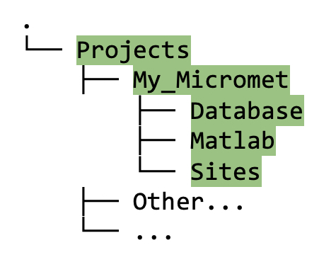
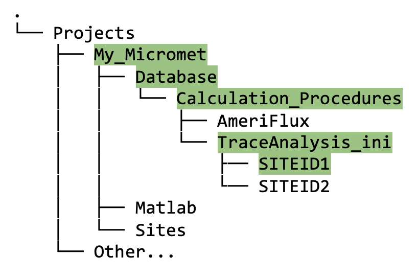

## 9. &nbsp; Quick Start Set Up: Project Directory Structure and Matlab Configuration

This section provides a quick-start summary of section 10a and 10b (see section 10 [XXX link] for a more detailed description of these steps).

Your project path is the file path to the root of your project folder. For example, if the name of your project is "My_Microsites", the project path might look like: 
```
projectPath = '/Users/<name>/Projects/My_MicrometSites/'
```

### 9.1 &nbsp; Instructions to create project directory structure and configure Matlab to work with the Biomet.net library

1. Pick *one* flux site to work with; note that site ID, which must be all upper case.

2. In Matlab, run the `create_TAB_ProjectFolders` function (which is in the `Biomet.net` library that you cloned), as follows:
    ```
    create_TAB_ProjectFolders('<projectPath>', 'SITEID')    
    ```
    Note that both input arguments are of type "string".

    In your project root directory (e.g., `My_MicrometSites` in figure 9.1), you should now see three new directories with the following names: (1) Database, (2) Matlab, (3) Sites. 

    
    
    *Figure 9.1. Directory tree showing contents of project folder after running the `create_TAB_ProjectFolders` Matlab function.* 

3. Next, run `set_TAB_project('<projectPath>')`. This process sets up the `Biomet.net` toolbox to work with your project. 

### 9.2 &nbsp; Short description of directory structure and contents

Only the new directories and files necessary to begin data cleaning are described here. For the long description see section 10 [xxx link].

#### Database directory
* The new `Database` directory contains `Calculation_Procedures`, and within `Calculation_Procedures`, there is one called `TraceAnalysis_ini`. 

* Within `TraceAnalysis_ini`, you will see a subdirectory named using your SITEID (`SITEID1` in this example), as follows:

    
    
    <br>

    Eventually (but not yet!), this `Database` directory will also contain the following:
    1. Initial database (created using the raw data from the `Sites` directory; see section [XXX add link] for how to do this);
    2. Your site-specific INI files that configure how the pipeline scripts will clean the data;
    3. The cleaned data once the INI files have been created and the pipeline has been run.


#### Sites directory
* Raw, *uncleaned* data from your site(s) is stored in the `<projectPath>/Sites` directory, under the appropriate SITEID. The data in this directory should remain *untouched* since we always want to preserve a copy of the raw data. 

    

#### Matlab directory
More details on the `<projectPath>/Matlab` directory are provided in the next section on configuring Matlab to work with the data structure [XXX link to Configure_Matlab_For_Data_Structure.md]. If everything appears as described above, then you can now move on to that section.

XXX Add short version of create database contents somewhere... here? new section?