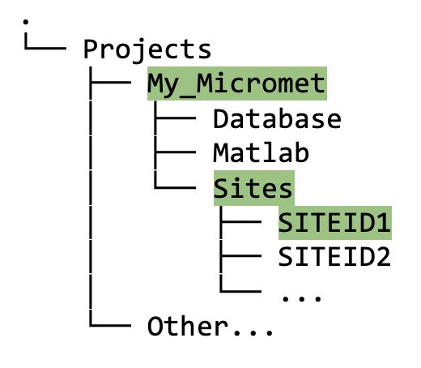

## 9. &nbsp; Quick Start Set Up: Project Directory Structure and Matlab Configuration

This section provides a quick-start summary of sections 10a and 10b (see section 10 [XXX link] for a more detailed description of these steps). You need the file path to your project root folder for these next steps. For example, if the name of your project is "My_Microsites", the project path might look like: 
```
projectPath = '/Users/<name>/Projects/My_MicrometSites/'
```

### 9.1 &nbsp; Instructions to create project directory structure and configure Matlab to work with the Biomet.net library

1. Pick *one* flux site to work with; note that site ID, which must be all upper case.

2. In Matlab, run the `create_TAB_ProjectFolders` function (which is in the `Biomet.net` library that you cloned), as follows:
    ```
    create_TAB_ProjectFolders('<projectPath>', 'SITEID')    
    ```
    Note that both input arguments are of type "string".

    In your project root directory (e.g., `My_MicrometSites` in figure 9.1), you should now see three new directories with the following names: (1) Database, (2) Matlab, (3) Sites. 

    
    
    *Figure 9.1. Directory tree showing contents of project folder after running the `create_TAB_ProjectFolders` Matlab function.* 

3. Next, run `set_TAB_project('<projectPath>')`. This process sets up the `Biomet.net` toolbox to work with your project. 

### 9.2 &nbsp; Short description of new directory structure and contents

Only the new directories and files necessary to get to this point and begin data cleaning are described here. For the long description see section 10 [xxx link].

#### Database directory
* The new `Database` directory contains a `Calculation_Procedures` directory, and within `Calculation_Procedures`, there is one called `TraceAnalysis_ini`. 

* Within `TraceAnalysis_ini`, you will see a subdirectory named using your SITEID (`SITEID1` in this example), as follows:

    
    
    <br>

    Eventually (but not yet!), this `Database` directory will also contain the following:
    1. Initial database (created using the raw data from the `Sites` directory; see section [XXX add link] for how to do this);
    2. Your site-specific INI files that configure how the pipeline scripts will clean the data;
    3. The cleaned data once the INI files have been created and the pipeline has been run.


#### Sites directory
* Raw, *uncleaned* data from your site(s) is stored in the `<projectPath>/Sites` directory, under the appropriate SITEID. The data in this directory should remain *untouched* since we always want to preserve a copy of the raw data. 

    

#### Matlab directory
* This directory should now contain three matlab files: (1) `get_TAB_project_configuration.m` which was created "behind the scenes" in step 2 above, then used in step 3; (2) `biomet_database_default.m`; and (3) `biomet_sites_default.m`. These functions are used in the pipeline behind the scenes, and will also be useful to you later, when you want to visualize your data.

More details on the `<projectPath>/Matlab` directory are provided in section 10b [XXX link] on configuring Matlab to work with the data structure. 

XXX Add short version of create database contents somewhere... here? new section?