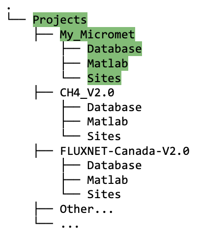

## Set up Project Directory Structure

Each user should have at least one `Project` directory. This project folder encompasses data cleaning/analysis/research for a group of similar flux sites, e.g., FLUXNET-Canada-V2.0. This section describes what your project directory structure should look like for the existing data cleaning scripts to operate successfully. Note that your `<projectPath>` is the full filepath to your `Project` root directory.

### To create the correct directory structure:
* In Matlab, run the `create_TAB_ProjectFolders.m` function (from the `Biomet.net` library that you cloned), as follows:
`create_TAB_ProjectFolders(<projectPath>, 'SITE-ID')`,
where SITE-ID

OLD
* In your `Project` root directory, create three directories with the following names: (1) Database, (2) Matlab, (3) Sites. In this directory tree example, there are three project root directories to illustrate the structure: My_MicrometSites (highlighted in green), CH4_V2.0, and FLUXNET-Canada-V2.0; as mentioned you may only have one. 

#### Database directory
* The `Database` directory will contain the following:
1. Initial database (created using the raw data from the `Sites` directory; see section [XXX add link] for how to do this);
2. Your site-specific INI files that clean the data, and also the cleaned data once they have been created.

* Next, within the new `Database` directory you just made, create a new directory called `Calculation_Procedures`. 
* Within `Calculation_Procedures`, create a subdirectory called `TraceAnalysis_ini`.
* Next, within `TraceAnalysis_ini`, create subdirectories for each project measurement site, named using your siteIDs, as follows:

[XXX edit image to have uppercase for siteIDs! e.g. SITE-ID1]

[XXX create Matlab function given siteID, to check uppercase, and create highlighted path in DirectoryTree2.jpg, also including Derived_Variables and log folder]

**Important note**: we enforce using *uppercase* for site IDs, to avoid problems between running cleaning on Mac vs. Windows.

#### Sites directory
* Raw, *uncleaned* data from your site(s) is stored in the `<projectPath>/Sites` directory, under the appropriate siteID. The data in this directory should remain *untouched* since we always want to preserve a copy of the raw data. 

For more details on setting up the `<projectPath>/Matlab` directory, see the section on configuring Matlab to work with the data structure [link to Configure_Matlab_For_Data_Structure.md].